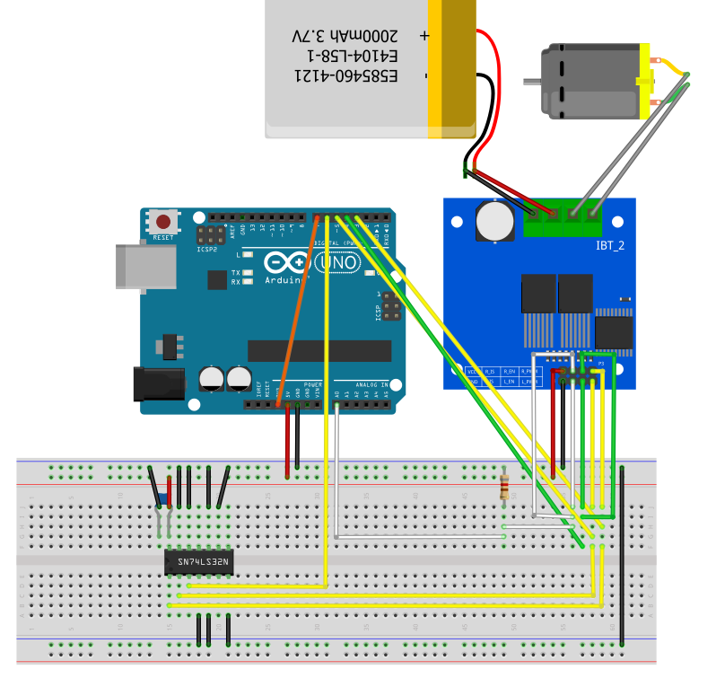
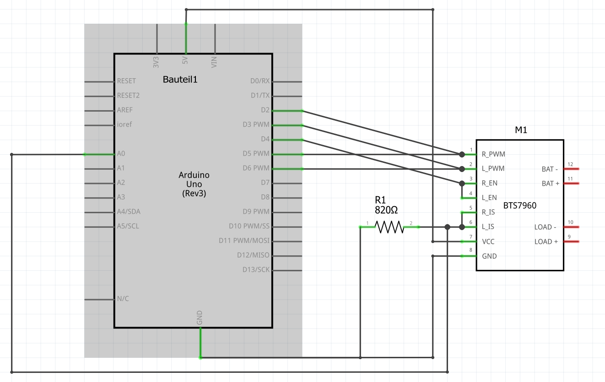

# IBT2-Library

Arduino library for 43A IBT_2 motor driver modlue with two BTS7960 High Current
PN Half Bridge ICs. This library supports current sensing.

Release Notes:

Version 1.0 - 20.11.2019

	* Initial version
